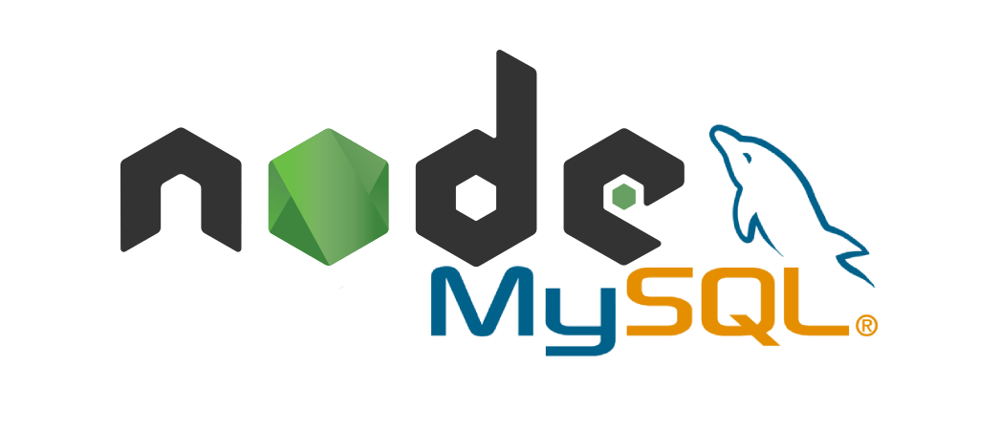

# api-rest-nodejs

Api rest de gestion de membres en nodejs, connectée à une base de données mysql avec le module promise-mysql pour gérer les promesses sur les requêtes

- promise-mysql - https://www.npmjs.com/package/mysql-promise
